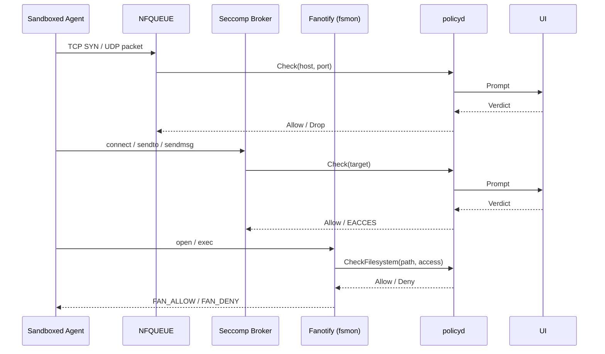

# agent-sandbox

Sandbox AI agent CLIs in a bubblewrap jail on NixOS. Intercepts network, filesystem, sudo, and device access. Prompts the user for approval through a Qt or zenity dialog, or `agent-sandbox-approve` on the host.

## What it gates

- **Network** (NFQUEUE + seccomp): each sandbox gets its own netns. Outbound TCP/UDP is captured at the kernel level. A seccomp broker also traps `connect`, `sendto`, `sendmsg`, `sendmmsg` so a short-timeout UDP client blocks inside the kernel until you answer the prompt, not before.
- **Filesystem** (fanotify): in dynamic mode (`gates.filesystem.enable`), fanotify mediates every file open. Access is classified as read, write, read-write, or execute by reading the blocked tracee's syscall arguments from `/proc/{pid}/syscall`. Stale verdicts in fanotify's event fd are avoided this way. Static bwrap mounts still define the structural read-only/read-write boundary.
- **Resources** (seccomp): `gates.resources.enable` traps `connect`, `open`, `openat`, `openat2`, `creat` to gate AF_UNIX sockets under `/run` and device nodes under `/dev`. The broker emulates the syscall itself via `pidfd_getfd` so the tracee never touches the gated resource directly (no TOCTOU).
- **Sudo**: `sudoPolicy = "approve"` intercepts `sudo` inside the sandbox. Approved commands run as root on the host, not inside the jail.

## Policy

Three layers merge with deny-wins semantics:

1. NixOS configuration (`declarativeAllow` / `declarativeDeny`).
2. User policy at `~/.config/agent-sandbox/policy.json`.
3. Per-project policy at `<project>/.agent-sandbox/policy.json`.

Runtime session decisions (allow/deny for once or session) layer on top.

Both policy files are write-protected: policyd injects implicit deny-write rules and fingerprints them by inode, so writing through a hardlink at any path is caught.

```json
{
  "network": {
    "allow": [{ "host": "api.example.com", "port": 443 }],
    "deny": []
  },
  "sudo": {
    "allow": [{ "argv": ["systemctl", "restart"] }],
    "deny": []
  },
  "filesystem": {
    "allow": [{ "path": "~/projects/foo", "access": "read_write" }],
    "deny": [{ "path": "./**/.env", "access": "read_write" }]
  },
  "resources": {
    "allow": [{ "kind": "unix_socket", "path": "/run/user/1000/bus", "access": "connect" }],
    "deny": [{ "kind": "device", "path": "/dev/mem", "access": "open_read_write" }]
  }
}
```

Filesystem paths support `~/` (home-relative), `./` (project-relative), and `**` glob matching. Network rules support wildcard domains (`*.example.com`) and IP prefixes (`34.230.40.*`). Sudo rules match by argv prefix. Resource kinds: `unix_socket`, `device`. Resource access: `connect`, `send`, `open_read`, `open_write`, `open_read_write`.

See `nix/modules/nixos/agent-sandbox/agent-sandbox.nix` for the full option reference.

```nix
{
  imports = [ inputs.agent-sandbox.nixosModules.agent-sandbox ];

  agent-sandbox = {
    enable = true;
    sudoPolicy = "approve";
    network.enable = true;
    gates = {
      filesystem.enable = true;
      resources.enable = true;
      syscalls.enable = true;
    };
    packages = [
      {
        package = pkgs.llm-agents.omp;
        readwriteDirs = [ "~/.omp" ];
      }
    ];
  };
}
```

## Approval UI

`agent-sandbox-ui` connects to policyd's host socket and shows approval prompts. It tries `agent-sandbox-qt-dialog` (standalone Qt6, no KDE/GTK dependency) then `zenity` as fallback. Set `uiBackend = "none"` for headless setups and use `agent-sandbox-approve` from a terminal instead.

## Architecture



## Repository

| Crate | Purpose |
| --- | --- |
| `agent-sandbox-core` | Shared types, RPC protocol, policy model, host matching. |
| `agent-sandbox-policyd` | Policy daemon: merge, approval state, UI routing, session tracking. |
| `agent-sandbox-nfq` | NFQUEUE network enforcer. |
| `agent-sandbox-syscall` | Seccomp BPF builder and shared syscall tables. |
| `agent-sandbox-syscall-arm` | In-sandbox helper: installs seccomp filter, hands listener fd to broker. |
| `agent-sandbox-syscall-broker` | Host-side seccomp notification broker. |
| `agent-sandbox-dns` | DNS forwarder with IP-to-hostname caching. |
| `agent-sandbox-fsmon` | Fanotify filesystem monitor and fs-arm helper. |
| `agent-sandbox-cli` | `agent-sandbox-approve`, `agent-sandbox-elevate`, `agent-sandbox-ui`, `agent-sandbox-open-ui-fd`. |
| `agent-sandbox-enter` | `setns` wrapper to join a netns as unprivileged user. |
