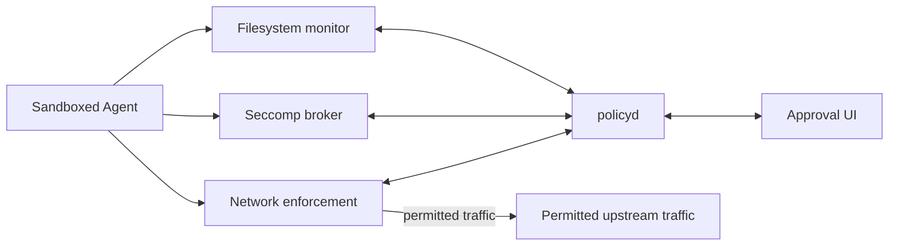
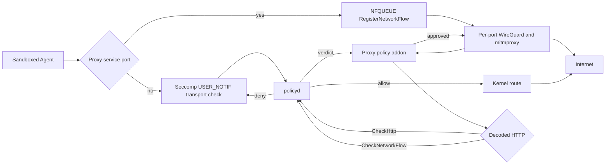

# agent-sandbox

Sandbox AI agent CLIs in a bubblewrap jail on NixOS. Intercepts network, filesystem, sudo, and device access. Prompts the user for approval through a Qt or zenity dialog, or `agent-sandbox-approve` on the host.

## What it gates

- **Network** (NFQUEUE + seccomp): each sandbox gets its own netns. Outbound TCP/UDP is captured at the kernel level. A seccomp broker also traps `connect`, `sendto`, `sendmsg`, `sendmmsg` so a short-timeout UDP client blocks inside the kernel until you answer the prompt, not before.
- **Decoded HTTP (optional)**: `network.httpProxy.enable` routes HTTP/1.1 and HTTP/2 through the trusted mitmproxy WireGuard service. UDP/443 (HTTP/3/QUIC) receives only a transport-level check, not decoded HTTP policy. HTTP rules match method, authority, effective port, and normalized path; query strings and fragments are never persisted or sent to policyd. Destinations that remain local, including loopback, receive the transport policy check instead of HTTP interception. Generic TCP/UDP remains transport-gated and unsupported or failed interception is denied.
- **Filesystem** (fanotify): in dynamic mode (`gates.filesystem.enable`), fanotify mediates every file open. Access is classified as read, write, read-write, or execute by reading the blocked tracee's syscall arguments from `/proc/{pid}/syscall`. Stale verdicts in fanotify's event fd are avoided this way. Static bwrap mounts still define the structural read-only/read-write boundary.
- **Resources** (seccomp): `gates.resources.enable` traps `connect`, `open`, `openat`, `openat2`, `creat` to gate AF_UNIX sockets under `/run` and device nodes under `/dev`. The broker emulates the syscall itself via `pidfd_getfd` so the tracee never touches the gated resource directly (no TOCTOU).
- **Sudo**: `sudoPolicy = "approve"` intercepts `sudo` inside the sandbox. Approved commands run as root on the host, not inside the jail. Sudo rules match by argv prefix, so approving `["systemctl"]` permits any subcommand. Approving interpreters like `["bash"]` grants arbitrary code execution as root. Bare argv[0] names resolve through `/run/current-system/sw/bin`; absolute argv[0] paths must be under `/run/current-system`. After canonicalization, the target must be a regular file under `/nix/store`. Symlinks from outside the system profile are rejected, preventing path traversal and multi-call binary spoofing.

## Policy

Three layers merge with deny-wins semantics:

1. NixOS configuration (`declarativeAllow` / `declarativeDeny`).
2. User policy at `~/.config/agent-sandbox/policy.json`.
3. Per-project policy at `<project>/.agent-sandbox/policy.json`.

Runtime session decisions (allow/deny for once or session) layer on top.

Both policy files are write-protected: policyd injects implicit deny-write rules and fingerprints them by inode, so writing through a hardlink at any path is caught.

```json
{
  "network": {
    "direct": {
      "allow": [{ "host": "api.example.com", "port": 443 }],
      "deny": []
    },
    "http": {
      "allow": [
        { "methods": ["GET"], "url": "https://api.example.com/v1" },
        { "methods": ["GET"], "url": "https://api.github.com/repos/*/*" }
      ],
      "deny": [{ "methods": [], "url": "https://api.example.com/v1/telemetry" }]
  },
  "sudo": {
    "allow": [{ "argv": ["systemctl", "restart"] }],
    "deny": []
  },
  "filesystem": {
    "allow": [{ "path": "~/projects/foo", "access": "read_write" }],
    "deny": [{ "path": "./**/.env", "access": "read_write" }]
  },
  "resources": {
    "allow": [{ "kind": "unix_socket", "path": "/run/user/1000/bus", "access": "connect" }],
    "deny": [{ "kind": "device", "path": "/dev/mem", "access": "open_read_write" }]
  }
}
```

Filesystem paths support `~/` (home-relative), `./` (project-relative), and `**` glob matching. Direct network rules support wildcard domains (`*.example.com`), IP prefixes (`34.230.40.*`), and general `*`/`?` globs (for example, `api-?.example.*`). HTTP `url` rules can be exact URLs or globs: exact URLs are canonicalized, while literal paths retain prefix/segment-boundary behavior (`/v1` matches `/v1/...` but not `/v10`). URL globs match canonical URL strings; `*` matches within one slash-delimited segment and `**` can cross `/` segments. For example, `https://api.github.com/repos/*/*` matches one repository path level after `/repos/`. Query strings and fragments are disallowed. Sudo rules match by argv prefix: a rule authorizes the full prefix and all trailing arguments, so broad prefixes like `["bash"]` grant unrestricted root execution. Resource kinds: `unix_socket`, `device`. Resource access: `connect`, `send`, `open_read`, `open_write`, `open_read_write`.

See `nix/modules/nixos/agent-sandbox/agent-sandbox.nix` for the full option reference.

```nix
{
  imports = [ inputs.agent-sandbox.nixosModules.agent-sandbox ];

  agent-sandbox = {
    enable = true;
    sudoPolicy = "approve";
    network = {
      enable = true;
      httpProxy.enable = true;
    };
    gates = {
      filesystem.enable = true;
      resources.enable = true;
      syscalls.enable = true;
    };
    packages = [
      {
        package = inputs.llm-agents.packages.${system}.omp;
        readwriteDirs = [ "~/.omp" ];
      }
    ];
  };
}
```

## Approval UI

`agent-sandbox-ui` connects to policyd's host socket and shows approval prompts. It tries `agent-sandbox-qt-dialog` (standalone Qt6, no KDE/GTK dependency) then `zenity` as fallback. Set `uiBackend = "none"` for headless setups and use `agent-sandbox-approve` from a terminal instead.

## Architecture



The network path has two modes:



In proxy mode, only public TCP ports 80, 443, 8008, 8080, and 8443 plus UDP/443 are routed through WireGuard, registered, and checked by NFQUEUE.
All other traffic keeps the namespace's ordinary kernel route and is gated by the seccomp user-notification broker. The calling thread remains blocked inside its network syscall while the transport approval is pending, so its application-level request timer does not expire first.
This lets decoded HTTP/HTTPS reach the addon without a duplicate `tcp://host:port` transport prompt.
The addon opens one liveness session at startup and claims each registered flow.
Decoded HTTP requests use `CheckHttp`; raw fallback uses deferred cancellable `CheckNetworkFlow`, except opaque TCP/TLS on ports 443 and 8443, which is killed fail-closed.
UDP/443 is treated as an HTTP/3-over-QUIC transport check.

## Repository

| Crate                          | Purpose                                                                                           |
| ------------------------------ | ------------------------------------------------------------------------------------------------- |
| `agent-sandbox-core`           | Shared types, RPC protocol, policy model, host matching.                                          |
| `agent-sandbox-policyd`        | Policy daemon: merge, approval state, UI routing, session tracking.                               |
| `agent-sandbox-nfq`            | NFQUEUE network enforcer.                                                                         |
| `agent-sandbox-syscall`        | Seccomp BPF builder and shared syscall tables.                                                    |
| `agent-sandbox-syscall-arm`    | In-sandbox helper: installs seccomp filter, hands listener fd to broker.                          |
| `agent-sandbox-syscall-broker` | Host-side seccomp notification broker.                                                            |
| `agent-sandbox-dns`            | DNS forwarder with IP-to-hostname caching.                                                        |
| `agent-sandbox-fsmon`          | Fanotify filesystem monitor and fs-arm helper.                                                    |
| `agent-sandbox-cli`            | `agent-sandbox-approve`, `agent-sandbox-elevate`, `agent-sandbox-ui`, `agent-sandbox-open-ui-fd`. |
| `agent-sandbox-enter`          | `setns` wrapper to join a netns as unprivileged user.                                             |
