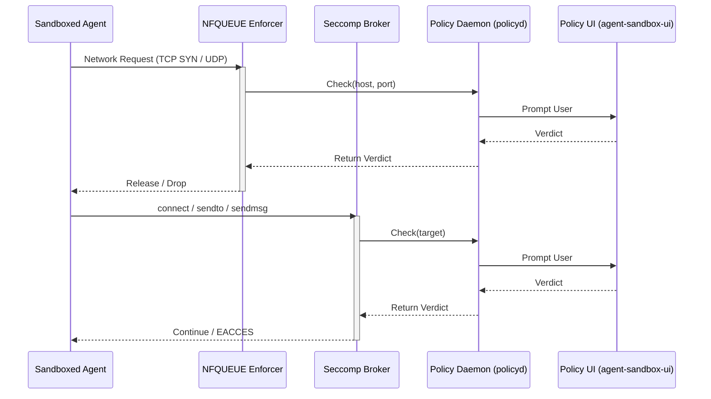

# agent-sandbox

agent-sandbox wraps AI agent CLIs in a bubblewrap sandbox on NixOS. It intercepts network, filesystem, and sudo requests and prompts the user for approval through `agent-sandbox-ui` (graphical Qt or zenity dialogs) or `agent-sandbox-approve` on the host.

## How it works

The sandbox runs agent processes inside a bubblewrap jail. A policy daemon (policyd) merges rules from configuration files, holds unknown requests, and routes approval prompts to the user. Three different enforcers mediate access:

- **NFQUEUE** captures outbound TCP SYN and UDP packets and consults policyd before releasing them. Loopback (`127.0.0.1`, `::1`) is policy-bound, never bypassed. DNS to the in-netns forwarder on port 53 always bypasses so name resolution can never be blocked.
- **seccomp user notification** traps the tracee's `connect`, `sendto`, `sendmsg`, and `sendmmsg` syscalls at the kernel. A host-side broker receives the notification fd via `SCM_RIGHTS`, asks policyd for a verdict, and either continues the syscall or rewrites the return value to `EACCES`. This blocks the process itself, not just the packet, so UDP `sendto` cannot race past a prompt.
- **fanotify** mediates filesystem access at the kernel level when dynamic approval is enabled. The first process inside each sandbox becomes `agent-sandbox-fs-arm`, which requests a fanotify monitor from policyd before execing the real entry point.

Sudo elevation prepends the agent-sandbox guard to the sandbox PATH so that plain `sudo` inside the agent routes through policyd; an approved command runs as root on the host, not inside the bubblewrap jail. The host's `/run/wrappers/bin/sudo` is left untouched.



## Capabilities

### Network isolation

Each sandbox runs in a dedicated network namespace (netns). A veth pair connects the netns to the host. The NFQUEUE enforcer captures outbound TCP SYN and UDP packets, consults policyd for each (host, port) pair, and holds the packet until policyd returns an allow or deny verdict. A DNS forwarder inside the netns caches IP-to-hostname mappings so the policy daemon can match rules by hostname rather than raw IP.

DNS responses are only honored when they arrive from the configured forwarder IP on port 53. A forged UDP/53 response from any other source falls through to the policy-boundary path and is not allowed to populate the IP-to-hostname cache. UDP/53 to any destination other than the configured forwarder is consulted against policy; only traffic to the forwarder on port 53 is treated as bypass. Loopback (`127.0.0.1`, `::1`) is also policy-bound, never bypassed.

### Process-level syscall gate (seccomp)

When the policy context is enabled (network, dynamic-FS, or sudo-approve), the wrapper prepends `agent-sandbox-syscall-arm` to the entry chain. The arm helper installs a seccomp BPF filter, hands the notification listener fd back to its parent via `SCM_RIGHTS` on a `SOCK_STREAM` socket pair, and execs the real agent. The host spawns `agent-sandbox-syscall-broker` to consume the listener.

The broker uses `pidfd_open` + `pidfd_getfd` (Linux 5.6+) to obtain a usable fd for the tracee's socket, then queries `getsockopt(SO_TYPE)` to map the socket to a URL scheme: `SOCK_STREAM` becomes `tcp://`, `SOCK_DGRAM` becomes `udp://`. A failed lookup falls back to the syscall's default scheme. Cancellations from the UI produce a one-time `Deny` so the agent unblocks with `EACCES` rather than waiting for the approval timeout.

The seccomp filter traps `connect`, `sendto`, `sendmsg`, and `sendmmsg`. The `sendmsg` used to bootstrap the `SCM_RIGHTS` handoff is intentionally not trapped. The arm and broker run on both x86_64 and aarch64.

### Local policy and host IPC boundary

The trusted user and per-project policy files live under `~/.config/agent-sandbox/` on the host so the user can track them with a dotfiles manager. In dynamic filesystem mode the wrapper bind-mounts the entire host root, so by default that directory is writable from inside the sandbox. The wrapper rebinds `~/.config/agent-sandbox/` read-only on top of the broad bind, so the sandboxed agent cannot rewrite the trusted policy files even though they live in the user's home. Policyd (running on the host) and the user's `agent-sandbox-approve` CLI are the only writers.

To let the agent read its trusted config without prompting on every access, add the path to the package `readonlyDirs` so it is auto-allowed by fanotify:

```nix
agent-sandbox = {
  packages = [ {
    package = pkgs.hello;
    readonlyDirs = [ "~/.config/agent-sandbox" ];
  } ];
};
```

The bwrap read-only rebind still blocks writes regardless of the fanotify decision.

### Filesystem isolation

Static bubblewrap mounts define the structural write boundary: directories and files are mounted read-only or read-write per package configuration. When `filesystem.dynamicApproval.enable` is true, fanotify mediates filesystem access at the kernel level. The first process inside each sandbox becomes `agent-sandbox-fs-arm`, which requests a fanotify monitor from policyd before execing the real entry point.

Host `/tmp` is similarly masked.

## Policy
Each policy file is a JSON document with `network`, `sudo`, and `filesystem` sections. Each section has an `allow` and a `deny` array.

```json
{
    "network": {
        "allow": [{ "host": "api.example.com", "port": 443 }],
        "deny": []
    },
    "sudo": {
        "allow": [{ "argv": ["systemctl", "restart"] }],
        "deny": []
    },
    "filesystem": {
        "allow": [{ "path": "~/projects/foo", "access": "read_write" }],
        "deny": []
    }
}
```

Network rules support wildcard parent domains (`*.example.com`) and IP prefix wildcards (`34.230.40.*`). Sudo rules match by command prefix: `["systemctl"]` allows `systemctl restart nginx`. Filesystem access levels: `read`, `write`, `read_write`, `execute`, `all`.

Policyd serialises and sorts policy files with one rule per line so that adjacent rules produce clean, minimal git diffs.

### Policy layering

Rules merge from lowest to highest priority:

1. **NixOS configuration:** `agent-sandbox.network.declarativeAllow` and `agent-sandbox.network.declarativeDeny` options.
2. **User policy:** `~/.config/agent-sandbox/policy.json`.
3. **Trusted project policy:** `~/.config/agent-sandbox/projects/<encoded-project-root>/policy.json`.
4. **Runtime session decisions:** approvals and denials recorded in memory (scopes `once` and `session`).

`<encoded-project-root>` keeps simple roots readable (`/home/user/dotfiles` becomes `home-user-dotfiles`). Spaces become `-`. Literal `-` and uncommon bytes are escaped as `~xx`. Ambiguous roots get a stable hash suffix to avoid practical slug collisions.

Denies win across all layers: a deny rule removes any matching allow rule, so a higher-priority policy cannot re-allow a previously denied target.

## NixOS setup

Add the flake input and enable the module on a NixOS host.

```nix
# flake.nix
{
  inputs.agent-sandbox.url = "github:tdortman/agent-sandbox";
  inputs.agent-sandbox.inputs.nixpkgs.follows = "nixpkgs";
}
```

```nix
# configuration.nix
{ inputs, pkgs, ... }:
{
  imports = [ inputs.agent-sandbox.nixosModules.agent-sandbox ];

  agent-sandbox = {
    enable = true;
    network.enable = true;
    packages = [
      {
        package = pkgs.hello;
        readwriteDirs = [ "~/.config/hello" ];
      }
    ];
  };
}
```

See `./nix/modules/nixos/agent-sandbox/agent-sandbox.nix` for the full list of NixOS options.

## Policy UI

The `agent-sandbox-ui` binary is the long-lived UI client. It connects to the policyd host socket, registers for the current context, and surfaces incoming approval prompts (network, elevation, filesystem) as graphical dialogs.

When a graphical session is detected, the UI tries backends in priority order:

1. `agent-sandbox-qt-dialog` (a standalone Qt Widgets helper, no KDE or GTK dependency).
2. `zenity` (fallback).

`AGENT_SANDBOX_UI_BACKEND` can pin a specific backend (`qt-dialog`, `zenity`, `none`). `AGENT_SANDBOX_UI_PREFER_GRAPHICAL=1` forces graphical prompts even when no display is detected at startup. If no UI client is registered for a request, policyd spawns one on demand.

If no graphical backend is available, the prompt is treated as cancelled (denied). For headless or SSH workflows, set `uiBackend = "none"` and use `agent-sandbox-approve` from a terminal instead.

`agent-sandbox-open-ui-fd` pre-registers a policyd UI connection on the host and execs the sandbox launcher with the connected stream on a kernel-assigned fd communicated via `AGENT_SANDBOX_UI_FD`. The inherited fd is the only approval path into the sandbox; later connections cannot register a UI or approve pending requests. Cancellations from the UI send a one-time `Deny` so the tracee unblocks with `EACCES` rather than waiting for the approval timeout.

## CLI

`agent-sandbox-approve` manages pending policy requests from the host side.

```
agent-sandbox-approve pending                                  list waiting requests
agent-sandbox-approve approve <id> <scope>                     allow a specific request
agent-sandbox-approve approve-host <host> <port> <scope>       pre-approve a host and port
agent-sandbox-approve deny <id> [scope]                        deny a request (default scope: once)
```

Scopes control how long the decision persists.

| Scope     | Persistence                                                                       |
| --------- | --------------------------------------------------------------------------------- |
| `once`    | In-memory only for this policyd process.                                          |
| `session` | Bound to the sandbox session ID. Stored in policyd memory.                        |
| `project` | Written to `~/.config/agent-sandbox/projects/<encoded-project-root>/policy.json`. |
| `global`  | Written to `~/.config/agent-sandbox/policy.json`.                                 |

Each subcommand accepts `--home`, `--cwd`, and `--project-root` to override path resolution. `approve` and `approve-host` also accept `--session-id`.

`agent-sandbox-elevate` runs inside the sandbox to forward a command to policyd for host-side root execution.

## Repository

| Crate / directory                      | Purpose                                                                                                      |
| -------------------------------------- | ------------------------------------------------------------------------------------------------------------ |
| `agent-sandbox-core`                   | Shared types, RPC protocol, policy model, host matching, DNS wire format.                                    |
| `agent-sandbox-policyd`                | Policy daemon: merge, approval state, UI routing, session tracking.                                          |
| `agent-sandbox-nfq`                    | NFQUEUE network enforcer and packet interceptor.                                                             |
| `agent-sandbox-syscall`                | Seccomp BPF builder (`seccompiler`) and shared policy tables.                                                |
| `agent-sandbox-syscall-arm`            | In-sandbox child that installs the seccomp filter and hands the listener fd to the broker.                   |
| `agent-sandbox-syscall-broker`         | Host-side seccomp user-notification broker; consults policyd per syscall.                                    |
| `agent-sandbox-dns`                    | DNS forwarder with IP-to-hostname caching.                                                                   |
| `agent-sandbox-fsmon`                  | Fanotify filesystem monitor and fs-arm helper.                                                               |
| `agent-sandbox-cli`                    | CLI tools: `agent-sandbox-approve`, `agent-sandbox-elevate`, `agent-sandbox-ui`, `agent-sandbox-open-ui-fd`. |
| `agent-sandbox-enter`                  | `setns` wrapper to join a network namespace as an unprivileged process.                                      |
| `nix/packages/agent-sandbox/qt-helper` | Standalone Qt dialog helper binary (CMake + Qt6 Widgets).                                                    |
