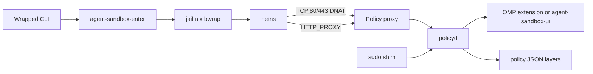

# agent-sandbox

Rust policy stack and NixOS module for running AI agent CLIs inside a [jail.nix](https://alexdav.id/projects/jail-nix/) bubblewrap sandbox, with optional deny-by-default egress and interactive host approvals.

## What you get

| Component         | Role                                                                                   |
| ----------------- | -------------------------------------------------------------------------------------- |
| **jail wrappers** | Replace agent binaries with sandboxed launchers (`unsafe-<name>` + `sandboxed-<name>`) |
| **policyd**       | JSON-line RPC over a Unix socket: merges policy layers, pending approvals, UI fan-out  |
| **policy proxy**  | HTTP CONNECT and transparent TCP redirect: asks policyd before connecting              |
| **DNS proxy**     | Records A/AAAA answers into a hostname cache for policy decisions                      |
| **CLIs**          | `agent-sandbox-approve`, `agent-sandbox-elevate`, `agent-sandbox-ui`                   |
| **enter**         | `agent-sandbox-enter` — join the sandbox network namespace before bwrap                |

## NixOS

```nix
{
  inputs.agent-sandbox.url = "github:tdortman/agent-sandbox";
  inputs.agent-sandbox.inputs.nixpkgs.follows = "nixpkgs";
}
```

```nix
nixosConfigurations.myhost = nixpkgs.lib.nixosSystem {
  modules = [
    inputs.agent-sandbox.nixosModules.agent-sandbox

    ({ pkgs, ... }: {
      agent-sandbox = {
        enable = true;
        network.enable = true;
        packages = [
          {
            package = pkgs.some-agent;
            readwriteDirs = [ "~/.config/my-agent" ];
          }
        ];
      };
    })
  ];
};
```

When `agent-sandbox.network.enable` is true, systemd runs `agent-sandbox-policy`, `agent-sandbox-netns`, `agent-sandbox-dns`, and `agent-sandbox-proxy`.

### Options (high level)

| Option                       | Default     | Meaning                                                          |
| ---------------------------- | ----------- | ---------------------------------------------------------------- |
| `enable`                     | false       | Master switch for wrapped packages and policy package on `$PATH` |
| `network.enable`             | false       | Netns + nftables + proxy + DNS cache                             |
| `sudoPolicy`                 | `"approve"` | `"deny"` or policy-gated `sudo` shim                             |
| `policy.interactiveApproval` | true        | Block unknown hosts until UI responds                            |
| `policy.approvalTimeout`     | `300`       | Seconds to wait for UI after connected                           |
| `policy.autoSpawnPolicyUi`   | true        | Spawn `agent-sandbox-ui` when no UI client is registered         |

See `nix/modules/nixos/agent-sandbox/agent-sandbox.nix` for mount paths, declarative allow/deny lists, veth addresses, and proxy tuning.

## Home Manager (OMP extension)

Policy prompts inside [oh-my-pi](https://github.com/can1357/oh-my-pi) sessions use a TypeScript extension shipped with this flake. OMP also auto-discovers `~/.omp/agent/extensions/*/index.ts`; the Home Manager module installs this tree for you.

```nix
{
  inputs.agent-sandbox.url = "github:tdortman/agent-sandbox";
  inputs.agent-sandbox.inputs.nixpkgs.follows = "nixpkgs";
}
```

```nix
# flake.nix (snowfall-lib dotfiles example)
homes.modules = [
  inputs.agent-sandbox.homeModules.agent-sandbox
];
```

```nix
# home.nix
programs.agent-sandbox.ompExtension.enable = true;
```

Source lives in `extensions/agent-sandbox/` (`index.ts`, `policy-client.ts`). With the extension enabled, policyd treats OMP as the primary UI (`ui_client: "omp"`) and `agent-sandbox-ui` exits when OMP is already connected.

## Architecture



### Network path

`agent-sandbox-enter` joins the `agent-sandbox` netns before bubblewrap. nftables drops egress by default and DNATs TCP 80/443 to the policy proxy on loopback inside the netns. Sandboxes resolve via `169.254.100.1` (`/etc/agent-sandbox/resolv.conf`).
The DNS proxy forwards to the host stub (typically `127.0.0.53:53`) and maintains `/run/agent-sandbox/dns-cache.json` for hostname-aware policy.

`transparentRedirect` (default true) catches clients that ignore proxy environment variables, `injectProxyEnv` (default true) sets `HTTP_PROXY` / `HTTPS_PROXY` for clients that honor them.

### Policy layers

Merged lowest → highest:

| Layer       | Source                                                                                 |
| ----------- | -------------------------------------------------------------------------------------- |
| Declarative | `/etc/agent-sandbox/declarative.json` (`network.declarativeAllow` / `declarativeDeny`) |
| Global      | `~/.config/agent-sandbox/policy.json`                                                  |
| Project     | `<repo>/.agent-sandbox/policy.json`                                                    |

`AGENT_SANDBOX_PROJECT_ROOT` is set at launch (git toplevel of `$PWD` when available). Project **deny** beats in-memory grants. policyd exports `/var/lib/agent-sandbox/exported-policy.json` for inspection, it is not loaded back into the merge stack.

Example project file:

```json
{
    "network": {
        "allow": [{ "host": "api.example.com", "port": 443 }],
        "deny": []
    },
    "sudo": {
        "allow": [{ "argv": ["systemctl", "restart"] }],
        "deny": []
    }
}
```

Sudo `argv` entries use prefix matching (`["systemctl"]` matches `systemctl restart nginx`).

### Approvals UI

One long-lived client registers with policyd (`register_ui`) and handles `network_request` and `elevation_request` pushes.

| Path                           | When                                                                   |
| ------------------------------ | ---------------------------------------------------------------------- |
| **OMP extension**              | `~/.omp/agent/extensions/agent-sandbox` in OMP `config.yml`            |
| **`agent-sandbox-ui`**         | OpenCode, Codex, etc. — kdialog on Plasma/Wayland, `/dev/tty` fallback |
| **`policy.autoSpawnPolicyUi`** | Spawns UI via `runuser` only when no client is connected               |
| **`agent-sandbox-approve`**    | Scripting: `pending`, approve/deny by id, `approve-host`               |

Spawn log: `/run/user/<uid>/agent-sandbox-ui.log`. Service log: `journalctl -u agent-sandbox-policy`.

### Sudo

| `sudoPolicy` | Behaviour                                                                       |
| ------------ | ------------------------------------------------------------------------------- |
| `approve`    | Jail `sudo` shim → `agent-sandbox-elevate` → policyd → UI → host root execution |
| `deny`       | Rejected in the shim                                                            |

## Development

```bash
nix develop          # Rust toolchain + pkg-config
cargo test --workspace
cargo clippy-strict  # pedantic clippy alias (see .cargo/config.toml)
```

Build binaries from Nix:

```bash
nix build .#default
nix build .#agent-sandbox
```
