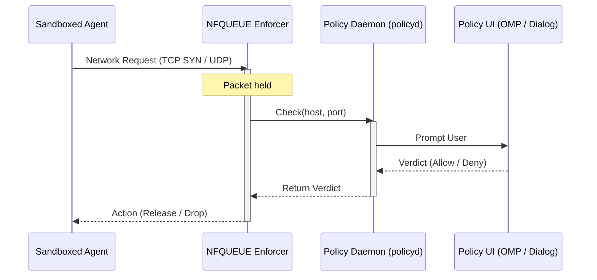

# agent-sandbox

agent-sandbox wraps AI agent CLIs in a bubblewrap sandbox on NixOS. It intercepts network, filesystem, and sudo requests and prompts the user for approval through the Oh My Pi (OMP) extension or a Qt/zenity dialog.

## How it works

The sandbox runs agent processes inside a bubblewrap jail. A policy daemon (policyd) merges rules from configuration files, holds unknown requests, and routes approval prompts to the user.



Sudo elevation and filesystem mediation follow the same flow, except they swap out the NFQUEUE enforcer (nfq) for their own respective handlers: a sudo shim for elevation, and fanotify for filesystem access. The OMP extension connects to `sandbox-policy.sock` inside the sandbox, registers once per session, and receives prompts in the OMP session TUI.

## Capabilities

### Network isolation

Each sandbox runs in a dedicated network namespace (netns). A veth pair connects the netns to the host. The NFQUEUE enforcer captures outbound TCP SYN and UDP packets, consults policyd for each (host, port) pair, and holds the packet until policyd returns an allow or deny verdict. A DNS forwarder inside the netns caches IP-to-hostname mappings so the policy daemon can match rules by hostname rather than raw IP.

DNS responses are only honored when they arrive from the configured forwarder IP on port 53. A forged UDP/53 response from any other source falls through to the policy-boundary path and is not allowed to populate the IP-to-hostname cache. UDP/53 to any destination other than the configured forwarder is consulted against policy; only traffic to the forwarder on port 53 is treated as bypass. Loopback (`127.0.0.1`, `::1`) is also policy-bound, never bypassed.

### Local policy and host IPC boundary

The trusted user and per-project policy files live under `~/.config/agent-sandbox/` on the host so the user can track them with a dotfiles manager. In dynamic filesystem mode the wrapper bind-mounts the entire host root, so by default that directory is writable from inside the sandbox. The wrapper rebinds `~/.config/agent-sandbox/` read-only on top of the broad bind, so the sandboxed agent cannot rewrite the trusted policy files even though they live in the user's home. Policyd (running on the host) and the user's `agent-sandbox-approve` CLI are the only writers.

To let the agent read its trusted config without prompting on every access, add the path to the package `readonlyDirs` so it is auto-allowed by fanotify:

```nix
agent-sandbox = {
  packages = [ {
    package = pkgs.hello;
    readonlyDirs = [ "~/.config/agent-sandbox" ];
  } ];
};
```

The bwrap read-only rebind still blocks writes regardless of the fanotify decision.

### Filesystem isolation

Static bubblewrap mounts define the structural write boundary: directories and files are mounted read-only or read-write per package configuration. When `filesystem.dynamicApproval.enable` is true, fanotify mediates filesystem access at the kernel level. The first process inside each sandbox becomes `agent-sandbox-fs-arm`, which requests a fanotify monitor from policyd before execing the real entry point.

In dynamic mode the wrapper mounts a fresh `tmpfs` over the entire host `/run` so unrelated host IPC sockets are invisible to the sandboxed process. The sandbox policy socket and any narrow `/run/...` mounts declared in the package configuration are rebound on top. Abstract Unix sockets are not filesystem paths: with `network.enable = true` they are isolated by the sandbox network namespace, not by fanotify. Host `/tmp` is similarly masked.

### Sudo elevation

When `sudoPolicy` is `"approve"`, the sandbox replaces `/run/wrappers/bin/sudo` with a shim that sends an elevation request to policyd. The host-side OMP extension or `agent-sandbox-approve` approves or denies the request. The approved command runs as root on the host, not inside the bubblewrap jail.

## Policy

Each policy file is a JSON document with `network`, `sudo`, and `filesystem` sections. Each section has an `allow` and a `deny` array.

```json
{
    "network": {
        "allow": [{ "host": "api.example.com", "port": 443 }],
        "deny": []
    },
    "sudo": {
        "allow": [{ "argv": ["systemctl", "restart"] }],
        "deny": []
    },
    "filesystem": {
        "allow": [{ "path": "~/projects/foo", "access": "read_write" }],
        "deny": []
    }
}
```

Network rules support wildcard parent domains (`*.example.com`) and IP prefix wildcards (`34.230.40.*`). Sudo rules match by command prefix: `["systemctl"]` allows `systemctl restart nginx`. Filesystem access levels: `read`, `write`, `read_write`, `execute`, `all`.

Policyd serialises and sorts policy files with one rule per line so that adjacent rules produce clean, minimal git diffs.

### Policy layering

Rules merge from lowest to highest priority:

1. **NixOS configuration:** `agent-sandbox.network.declarativeAllow` and `agent-sandbox.network.declarativeDeny` options.
2. **User policy:** `~/.config/agent-sandbox/policy.json`.
3. **Trusted project policy:** `~/.config/agent-sandbox/projects/<encoded-project-root>/policy.json`.
4. **Runtime session decisions:** approvals and denials recorded in memory (scopes `once` and `session`).

`<encoded-project-root>` keeps simple roots readable (`/home/user/dotfiles` becomes `home-user-dotfiles`). Spaces become `-`. Literal `-` and uncommon bytes are escaped as `~xx`. Ambiguous roots get a stable hash suffix to avoid practical slug collisions.

Denies win across all layers: a deny rule removes any matching allow rule, so a higher-priority policy cannot re-allow a previously denied target.

## NixOS setup

Add the flake input and enable the module on a NixOS host.

```nix
# flake.nix
{
  inputs.agent-sandbox.url = "github:tdortman/agent-sandbox";
  inputs.agent-sandbox.inputs.nixpkgs.follows = "nixpkgs";
}
```

```nix
# configuration.nix
{ inputs, pkgs, ... }:
{
  imports = [ inputs.agent-sandbox.nixosModules.agent-sandbox ];

  agent-sandbox = {
    enable = true;
    network.enable = true;
    packages = [
      {
        package = pkgs.hello;
        readwriteDirs = [ "~/.config/hello" ];
      }
    ];
  };
}
```

See `./nix/modules/nixos/agent-sandbox/agent-sandbox.nix` for the full list of NixOS options

## CLI

`agent-sandbox-approve` manages pending policy requests from the host side.

```
agent-sandbox-approve pending                                  list waiting requests
agent-sandbox-approve approve <id> <scope>                     allow a specific request
agent-sandbox-approve approve-host <host> <port> <scope>       pre-approve a host and port
agent-sandbox-approve deny <id> [scope]                        deny a request (default scope: once)
```

Scopes control how long the decision persists.

| Scope     | Persistence                                                                       |
| --------- | --------------------------------------------------------------------------------- |
| `once`    | In-memory only for this policyd process.                                          |
| `session` | Bound to the sandbox session ID. Stored in policyd memory.                        |
| `project` | Written to `~/.config/agent-sandbox/projects/<encoded-project-root>/policy.json`. |
| `global`  | Written to `~/.config/agent-sandbox/policy.json`.                                 |

Each subcommand accepts `--home`, `--cwd`, and `--project-root` to override path resolution. `approve` and `approve-host` also accept `--session-id`.

`agent-sandbox-elevate` runs inside the sandbox to forward a command to policyd for host-side root execution.

## OMP extension (Home Manager)

The OMP extension registers as the `omp` policy UI client with policyd and handles network and elevation approval prompts inside OMP sessions.

```nix
{ inputs, ... }:
{
  home-manager.users.myuser = { ... }:
  {
    imports = [ inputs.agent-sandbox.homeModules.agent-sandbox ];
    programs.agent-sandbox.ompExtension = {
      enable = true;
      agentDir = ".omp/agent";   # default
    };
  };
}
```

## Repository

| Crate / directory          | Purpose                                                                          |
| -------------------------- | -------------------------------------------------------------------------------- |
| `agent-sandbox-core`       | Shared types, RPC protocol, policy model, host matching, DNS wire format.        |
| `agent-sandbox-policyd`    | Policy daemon: merge, approval state, UI routing, session tracking.              |
| `agent-sandbox-nfq`        | NFQUEUE network enforcer and packet interceptor.                                 |
| `agent-sandbox-dns`        | DNS forwarder with IP-to-hostname caching.                                       |
| `agent-sandbox-fsmon`      | Fanotify filesystem monitor and fs-arm helper.                                   |
| `agent-sandbox-cli`        | CLI tools: `agent-sandbox-approve`, `agent-sandbox-elevate`, `agent-sandbox-ui`. |
| `agent-sandbox-enter`      | `setns` wrapper to join a network namespace as an unprivileged process.          |
| `extensions/agent-sandbox` | Oh My Pi extension (TypeScript) for approval prompts in the OMP TUI.             |
