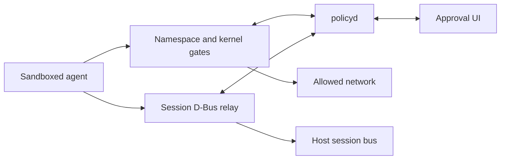

# agent-sandbox

Run agent CLIs inside a bubblewrap jail on NixOS. `policyd` checks network, HTTP, filesystem, Unix-socket, device, sudo, and D-Bus operations. Unknown operations wait for approval in the Qt or zenity dialog, or through `agent-sandbox-approve` on the host.

## Quick start

```nix
{
  imports = [ inputs.agent-sandbox.nixosModules.agent-sandbox ];

  agent-sandbox = {
    enable = true;
    network.enable = true;
    network.httpProxy.enable = true;
    gates.filesystem.enable = true;
    gates.resources.enable = true;
    gates.syscalls.enable = true;

    packages = [{
      package = inputs.llm-agents.packages.${system}.omp;
      readwriteDirs = [ "~/.omp" ];
    }];
  };
}
```

Use `sudoPolicy = "approve"` to gate sudo. Set `uiBackend = "none"` for headless systems. The full option reference is `nix/modules/nixos/agent-sandbox/agent-sandbox.nix`.

## What it gates

| Gate       | Behavior                                                                                                                                        |
| ---------- | ----------------------------------------------------------------------------------------------------------------------------------------------- |
| Network    | Per-sandbox network namespace and outbound TCP/UDP checks.                                                                                      |
| HTTP proxy | Optional HTTP/1.1, HTTP/2, and HTTP/3 inspection through mitmproxy.                                                                             |
| Filesystem | Static bubblewrap mount isolation when `gates.filesystem.enable` is disabled; enabling it switches to dynamic fanotify approval for file opens. |
| Resources  | Unix-socket operations and device access under `/dev`. `connect` and `send` are separate permissions.                                           |
| Sudo       | Approval before a command runs as root on the host. A rule such as `["bash"]` grants unrestricted root execution.                               |
| D-Bus      | Filtered session-bus access through a per-sandbox relay.                                                                                        |

## Policy

Policy files merge in this order, with denies taking precedence:

1. NixOS declarative policy.
2. `~/.config/agent-sandbox/policy.json`.
3. `<project>/.agent-sandbox/policy.json`.
4. Runtime decisions for the current request or session.

Filesystem paths, network hosts, HTTP URLs, and D-Bus fields support [globset syntax](https://docs.rs/globset/latest/globset/#syntax). Policy files are write-protected, including writes through hardlinks.

```json
{
  "network": {
    "direct": {
      "allow": [{ "host": "api.example.com", "port": 443, "comment": "API access" }],
      "deny": []
    },
    "http": {
      "allow": [{
        "methods": ["GET"],
        "url": "https://api.example.com/models",
        "comment": "Model listing"
      }],
      "deny": []
    }
  },
  "sudo": {
    "allow": [],
    "deny": []
  },
  "filesystem": {
    "allow": [
      { "path": "~/.cache/example", "access": "read", "comment": "Application cache" }
    ],
    "deny": []
  },
  "resources": {
    "allow": [
      {
        "kind": "unix_socket",
        "path": "/run/user/1000/example.sock",
        "access": "connect",
        "comment": "Example service"
      }
    ],
    "deny": []
  },
  "dbus": {
    "allow": [
      {
        "target": {
          "bus": "session",
          "destination": "org.freedesktop.portal.*",
          "object_path": "/org/freedesktop/portal/desktop",
          "interface": "org.freedesktop.portal.OpenURI",
          "member": "OpenURI",
          "message_kind": "method_call",
          "signature": "ssa{sv}",
          "fd_metadata": []
        },
        "comment": "Desktop portal access"
      }
    ],
    "deny": []
  }
}
```

## D-Bus

Set `agent-sandbox.policy.dbus.enable = true` to expose a filtered **session bus**. This requires `gates.resources.enable`, which blocks direct host IPC socket connections. The wrapper gives each sandbox its own relay and sets `DBUS_SESSION_BUS_ADDRESS` to that relay. Policyd checks destination, object path, interface, member, message kind, signature, and file-descriptor metadata.

The system bus is not proxied. A dynamic filesystem jail may still make `/run/dbus` visible because it binds the host root, but the resource gate rejects connect and send operations to `/run/dbus/*`, `/run/systemd/*`, and protected abstract D-Bus or systemd sockets. The relay also blocks name ownership, unrestricted match rules, and monitor activation.

## Approval UI

`agent-sandbox-ui` uses the packaged Qt dialog and falls back to zenity. Use `agent-sandbox-approve` when no graphical UI is available.

## Architecture



The workspace separates shared policy types, policyd, network enforcement, filesystem monitoring, syscall brokering, and command-line tools.
