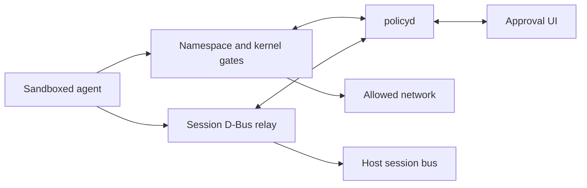

# agent-sandbox

Run agent CLIs inside a bubblewrap jail on NixOS. Unknown operations block until approved, or deny outright when `agent-sandbox.policy.interactiveApproval = false`.

## What it gates

| Gate       | Behavior                                                                                                                                        |
| ---------- | ----------------------------------------------------------------------------------------------------------------------------------------------- |
| Network    | Per-sandbox network namespace and outbound TCP/UDP checks.                                                                                      |
| HTTP proxy | Optional HTTP/1.0, HTTP/1.1, HTTP/2 and HTTP/3 inspection, including WebSocket upgrade relay and WebTransport, through the transparent proxy.   |
| Filesystem | Static bubblewrap mount isolation when `gates.filesystem.enable` is disabled; enabling it switches to dynamic fanotify approval for file opens. `gates.filesystem.ignoreStaticAllows` skips the monitor for statically allowed files that nothing can write. |
| Resources  | Unix-socket operations and device access under `/dev`. `connect` and `send` are separate permissions.                                           |
| Sudo       | Approval before a command runs as root on the host. A rule such as `["bash"]` grants unrestricted root execution.                               |
| D-Bus      | Filtered session and system bus access through a per-sandbox relay.                                                                             |

## Binary cache

Prebuilt store paths are published to Cachix. Direct users of this flake pick the cache up from `nixConfig` after the trust prompt. Flakes consumed as an input do not propagate `nixConfig`, so add the settings to the consuming flake:

```nix
nixConfig = {
  extra-substituters = [ "https://agent-sandbox.cachix.org" ];
  extra-trusted-public-keys = [
    "agent-sandbox.cachix.org-1:x7WgdtZjoPgbKdyk5oxP2QvN7B3SfuHmGvXKJ8xtTu0="
  ];
};
```

Or run `nix run nixpkgs#cachix use agent-sandbox`.

Pushes to `main` build the package and publish it to the cache through a pre-push hook. Enable it with `git config core.hooksPath .githooks`; skip a push with `git push --no-verify`.

## Quick start

```nix
{
  imports = [ inputs.agent-sandbox.nixosModules.agent-sandbox ];

  agent-sandbox = {
    enable = true;
    network.enable = true;
    network.httpProxy.enable = true;
    gates.filesystem.enable = true;
    gates.resources.enable = true;
    gates.syscalls.enable = true;

    packages = [{
      package = inputs.llm-agents.packages.${system}.omp;
      readwriteDirs = [ "~/.omp" ];
    }];
  };
}
```

Use `sudoPolicy = "approve"` to gate sudo. Set `uiBackend = "none"` for headless systems. The full option reference is `nix/modules/nixos/agent-sandbox/agent-sandbox.nix`.

For an upstream WebSocket endpoint that does not accept HTTP/2 Extended CONNECT, pin only that URL pattern to HTTP/1.1:

```nix
agent-sandbox.network.httpProxy.websocketHttp11Urls = [
  "https://api.openai.com/v1/live/rtc_*"
];
```

HTTP/3 interception stays disabled unless you enable it explicitly:

```nix
agent-sandbox.network.httpProxy.http3 = {
  enable = true;
  altUdpPorts = [ 4444 ];
};
```

To allow more than the default two seconds for upstream QUIC TLS handshakes:

```nix
agent-sandbox.network.httpProxy.http3.upstreamHandshakeTimeoutMs = 15000;
```

For upstream services that require mTLS, configure a runtime credentials file:

```nix
agent-sandbox.network.httpProxy.upstreamClientIdentitiesFile = "/run/secrets/proxy-identities.json";
```

The JSON file contains an array of exact HTTPS origins and PEM file paths:

```json
[
  {
    "origin": "https://api.example.com:8443",
    "certificate": "/run/secrets/api-client-chain.pem",
    "private_key": "/run/secrets/api-client-key.pem"
  }
]
```

Use a leaf-first certificate chain and an unencrypted private key. Set the JSON
file and PEM files to owner `agent-sandbox-proxy:agent-sandbox-proxy` with mode
`0600`. Parent directories must allow this user to traverse them. Keep private
keys outside the Nix store. Relative PEM paths resolve against the JSON file's directory.
Restart the proxy after changing credentials. The proxy rejects invalid keys,
mismatched certificates, and duplicate origins at startup.

Credentials apply to the exact HTTPS host and port on both TCP and HTTP/3.
They do not grant policy access or propagate the downstream client's TLS identity.
Other origins receive no client certificate. Wildcards and URL paths are rejected.

The standalone flags are `--upstream-client-identities FILE` and
`--http3-upstream-handshake-timeout-ms MILLISECONDS`.

Ordinary HTTPS requests negotiate `h2` or `http/1.1` independently of the
downstream HTTP version. Explicit HTTP/1.0 and WebSocket requirements still apply.
Downstream leaf certificates prefer ECDSA P-256, then P-384, then RSA according
to the client's advertised support.

## Share localhost

Sandboxed processes reach every TCP and UDP port on host `127.0.0.1` without configuration. Network policy checks each port as `127.0.0.1:<port>`, so an unapproved port prompts like any other destination. A listener in the sandbox's own namespace wins over the host.

Two cases still need a port list. The host can reach sandbox listeners only on listed ports, and IPv6 `::1` is shared only on listed ports:

```nix
agent-sandbox.network.loopback = {
  tcpPorts = [ 3080 49600 ];
  udpPorts = [ 5354 ];
};
```

Listed ports skip the policy prompt. A listener in the client's own namespace wins; otherwise the connection or datagram reaches the listener in the other namespace. No process binds the configured ports, so a host and sandbox service can both use the same port.

Host services see sandbox connections as coming from `127.0.0.1`. The sandbox's direct connections to the veth gateway (`169.254.100.1`) land on host localhost too, except DNS on port 53.

To let the proxy select HTTP/1.0 for an upstream origin, add its validated canonical origin:

```nix
agent-sandbox.network.httpProxy.http10UpstreamOrigins = [
  "https://legacy.example.com"
];
```

For a cleartext HTTP/2 service, select its exact origin:

```nix
agent-sandbox.network.httpProxy.h2cUpstreamOrigins = [
  "http://grpc.example.com:8080"
];
```

The standalone flag is `--h2c-upstream-origin ORIGIN`. These origins use HTTP/2
prior knowledge without HTTP/1 fallback. They cannot also be listed under
`http10UpstreamOrigins`. Cleartext HTTP/2 downstream connections are accepted;
HTTP/1 `Upgrade: h2c` remains rejected. Each request still requires HTTP policy
approval, including requests on an existing HTTP/2 connection.

Every TCP connection is intercepted regardless of port: NFQUEUE registers the
flow for the transparent proxy, which peeks at the first stream bytes to tell
TLS and HTTP apart from raw TCP. HTTP(S) takes the decoding policy path;
anything else is spliced end to end after one `tcp://host:port` policy check.
UDP keeps one configured intercept port (a socket must bind each port),
but the first payload byte decides: only QUIC long headers take the
HTTP/3 path, everything else takes the direct transport check.

`agent-sandbox.network.verdictGate.enable` adds a kernel-side decision path on
top of that. The NFQUEUE daemon publishes each replayable destination verdict
into a map pinned per sandbox namespace, and reuses it instead of asking
policyd again for the same destination. Denials are enforced by a
`cgroup/connect4` and `cgroup/connect6` program, which fails the connection
before any packet exists. Entries carry the generation of the decision set
they were published under, so withdrawing a grant retires every cached verdict
with one write. A missing or stale entry falls back to the userspace path, and
hostname-derived and one-time approvals are never cached.

The TCP proxy forwards informational responses such as `103 Early Hints` on
HTTP/1.1 and HTTP/2 before the final response. It forwards at most 16 upstream
interim responses per request and omits them for HTTP/1.0 clients.

## Policy

The policy layers load in this order. Denies take precedence across all layers:

1. NixOS declarative policy.
2. Package base policy, set per package on the host (`--package-declarative`).
3. Package home extension, `~/.config/agent-sandbox/packages/<package>.json`.
4. User policy, `~/.config/agent-sandbox/policy.json`.
5. Trusted project policy, `<project_root>/.agent-sandbox/policy.json`.
6. Package project policy, `<project_root>/.agent-sandbox/packages/<package>.json`.
7. Runtime decisions for the current request or session.

The package layers apply only to sessions attributed to that package. Runtime decisions apply after the file layers. The global, global package, project, and project package scopes write their rule back to a policy file; the once and session scopes keep the decision in memory for the current request or
session.

Filesystem paths, network hosts, HTTP URLs, and D-Bus target string fields support [globset syntax](https://docs.rs/globset/0.4.19/globset/#syntax). Matching uses globset's `literal_separator` mode: `*` and `?` do not match `/`, use `**` for recursive path matching. Policy files are read-and-write protected, including accesses through hardlinks.

```json
{
  "network": {
    "direct": {
      "allow": [{ "host": "api.example.com", "port": 443, "comment": "API access" }],
      "deny": []
    },
    "http": {
      "allow": [{
        "methods": ["GET"],
        "url": "https://api.example.com/models",
        "port": 443,
        "comment": "Model listing"
      }],
      "deny": []
    }
  },
  "sudo": {
    "allow": [],
    "deny": []
  },
  "filesystem": {
    "allow": [
      { "path": "~/.cache/example", "access": "read", "comment": "Application cache" }
    ],
    "deny": []
  },
  "resources": {
    "allow": [
      {
        "kind": "unix_socket",
        "path": "/run/user/1000/example.sock",
        "access": "connect",
        "comment": "Example service"
      }
    ],
    "deny": []
  },
  "dbus": {
    "allow": [
      {
        "target": {
          "bus": "session",
          "destination": "org.freedesktop.portal.*",
          "object_path": "/org/freedesktop/portal/desktop",
          "interface": "org.freedesktop.portal.OpenURI",
          "member": "OpenURI",
          "message_kind": "method_call",
          "signature": "ssa{sv}",
          "fd_metadata": []
        },
        "comment": "Desktop portal access"
      }
    ],
    "deny": []
  }
}
```

## D-Bus

Set `agent-sandbox.policy.dbus.enable = true` to expose filtered dbus sockets. This requires `gates.resources.enable`, which blocks direct host IPC socket connections. The wrapper gives each sandbox its own relay and sets `DBUS_SESSION_BUS_ADDRESS` to that relay. Policyd checks destination, object path, interface, member, message kind, signature, and file-descriptor metadata. Systemd sockets are automatically rejected, to prevent sandbox escapes through means like `systemd-run`.

## Approval UI

`agent-sandbox-ui` uses the packaged Qt dialog and falls back to zenity. Use `agent-sandbox-approve` when no graphical UI is available.

## Architecture


```mermaid
flowchart LR
    Agent["Sandboxed agent"] --> Gates["Namespace and kernel gates"]
    Agent --> Relay["Session D-Bus relay"]
    Gates <--> Policy["policyd"]
    Relay <--> Policy
    Policy <--> UI["Approval UI"]
    Gates --> Network["Allowed network"]
    Relay --> Session["Host session bus"]
```

The workspace splits shared policy types, policyd, network enforcement, filesystem monitoring, syscall brokering, and command-line tools into crates under `crates/`.
